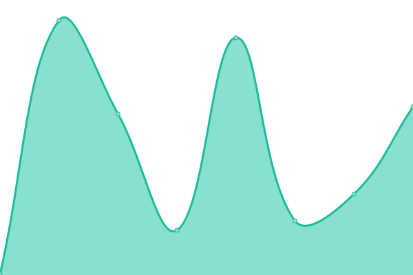
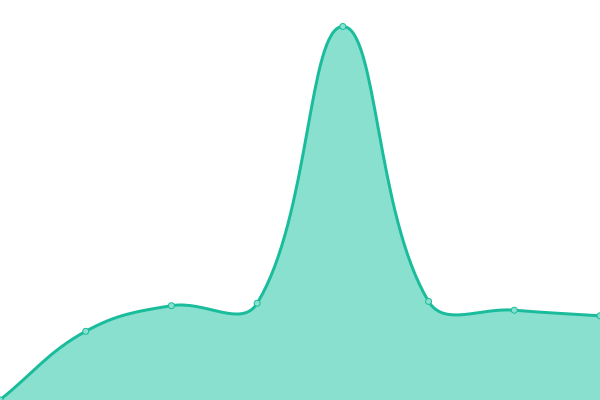

# [📈 Live Status](https://demo.upptime.js.org): <!--live status--> **🟧 Partial outage**

This repository contains the open-source uptime monitor and status page for [megasin2](https://demo.upptime.js.org), powered by [Upptime](https://github.com/upptime/upptime).

With [Upptime](https://upptime.js.org), you can get your own unlimited and free uptime monitor and status page, powered entirely by a GitHub repository. We use [Issues](https://github.com/megasin2/statustracker/issues) as incident reports, [Actions](https://github.com/megasin2/statustracker/actions) as uptime monitors, and [Pages](https://demo.upptime.js.org) for the status page.

<!--start: status pages-->
<!-- This summary is generated by Upptime (https://github.com/upptime/upptime) -->
<!-- Do not edit this manually, your changes will be overwritten -->
<!-- prettier-ignore -->
| URL | Status | History | Response Time | Uptime |
| --- | ------ | ------- | ------------- | ------ |
|  [Primary Server BUZZ](https://1hd.buzz) | 🟩 Up | [primary-server-buzz.yml](https://github.com/megasin2/statustracker/commits/HEAD/history/primary-server-buzz.yml) | 

 365ms
     
 | 

<a href="https://status.1hd.buzz/history/primary-server-buzz">100.00%</a>
    

|  [Moviebox-Server P-Server](https://moviebox.sbs) | 🟥 Down | [moviebox-server-p-server.yml](https://github.com/megasin2/statustracker/commits/HEAD/history/moviebox-server-p-server.yml) | 

 269ms
     
 | 

<a href="https://status.1hd.buzz/history/moviebox-server-p-server">0.00%</a>
    

|  [FastHD Server -VRC](https://fast.1hd.buzz) | 🟥 Down | [fast-hd-server-vrc.yml](https://github.com/megasin2/statustracker/commits/HEAD/history/fast-hd-server-vrc.yml) | 

 202ms
     
 | 

<a href="https://status.1hd.buzz/history/fast-hd-server-vrc">0.00%</a>
    

|  [Braflix Server -VRC](https://braflix.1hd.buzz) | 🟥 Down | [braflix-server-vrc.yml](https://github.com/megasin2/statustracker/commits/HEAD/history/braflix-server-vrc.yml) | 

 73ms
     
 | 

<a href="https://status.1hd.buzz/history/braflix-server-vrc">0.00%</a>
    

|  [StreamHD Server -VRC](https://stream.1hd.buzz) | 🟥 Down | [stream-hd-server-vrc.yml](https://github.com/megasin2/statustracker/commits/HEAD/history/stream-hd-server-vrc.yml) | 

 127ms
     
 | 

<a href="https://status.1hd.buzz/history/stream-hd-server-vrc">0.00%</a>
    

|  [Watch Server -VRC](https://watch.1hd.buzz) | 🟥 Down | [watch-server-vrc.yml](https://github.com/megasin2/statustracker/commits/HEAD/history/watch-server-vrc.yml) | 

 207ms
     
 | 

<a href="https://status.1hd.buzz/history/watch-server-vrc">0.00%</a>
    

|  [Play Server -CC-VID](https://play.1hd.buzz) | 🟩 Up | [play-server-cc-vid.yml](https://github.com/megasin2/statustracker/commits/HEAD/history/play-server-cc-vid.yml) | 

 1103ms
     
 | 

<a href="https://status.1hd.buzz/history/play-server-cc-vid">100.00%</a>
    

|  [Status Server -Github](https://status.1hd.buzz) | 🟥 Down | [status-server-github.yml](https://github.com/megasin2/statustracker/commits/HEAD/history/status-server-github.yml) | 

 0ms
     
 | 

<a href="https://status.1hd.buzz/history/status-server-github">100.00%</a>
    

<!--end: status pages-->

[**Visit our status website →**](https://demo.upptime.js.org)

## 📄 License

- Powered by: [Upptime](https://github.com/upptime/upptime)
- Code: [MIT](./LICENSE) © [Anand Chowdhary](https://anandchowdhary.com), supported by [Pabio](https://pabio.com)
- Data in the `./history` directory: [Open Database License](https://opendatacommons.org/licenses/odbl/1-0/)
